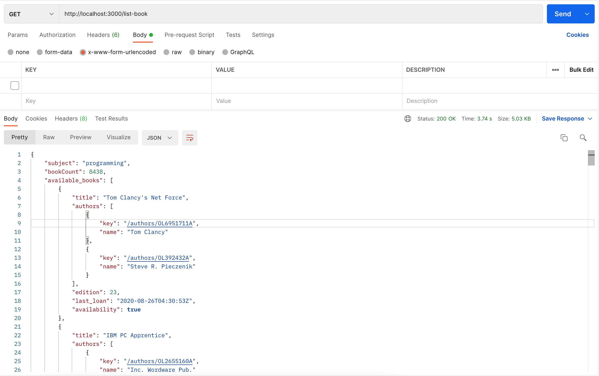
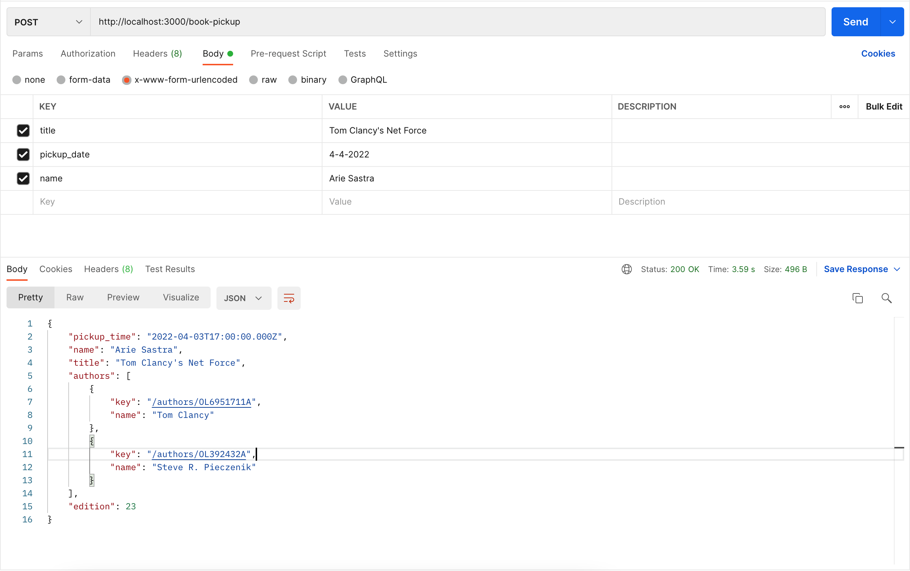

# Library Servcies

## Deskripsi
Aplikasi ini adalah aplikasi backend yang dibuat menggunakan NodeJS & Express, untuk proses peminjaman buku dan melakukan online booking untuk pickup / pengambilan buku.

## Repo
Applikasi ini saya masukan ke dalam GIT Repository saya, yaitu [URL](https://github.com/ariesastra/LibraryLoan)

## Instalasi
- Aplikasi ini menggunakan NodeJS dan Node Package Manager (NPM), untuk proses instalasi, lakukan pengetikan kode `npm i` pada terminal.
- API endpoint yang saya gunakan untuk aplikasi ini ada di [API Docs](https://documenter.getpostman.com/view/8074442/UVysxFcM)

## Menjalankan Applikasi
- Setelah proses instalasi selesai, ketik command ```npm run dev``` dalam root directory dimana *package.json* berada.
- setelah itu, buka aplikasi untuk menjalankan request seperti ```postman, thunderclient``` atau aplikasi yang sering Anda gunakan untuk melakukan request API.

## Hasil
Berikut beberapa hasil yang sudah saya develop dan test di local saya : 

- List Book

- Pickup


## Asumsi
Beberapa asumsi yang saya tambahkan ketika proses development adalah :
- Subjects yang digunakan untuk proses penarikan data adalah subject *Programminng*.
- Menambahkan Nama pada proses pickup bookinng.
- Hanya menampilkan 100 buku pada proses penarikan data di Open Libraray, dengan ketentuan buku yang ditampilkan adalah buku yang memiliki *availablelity true*. 